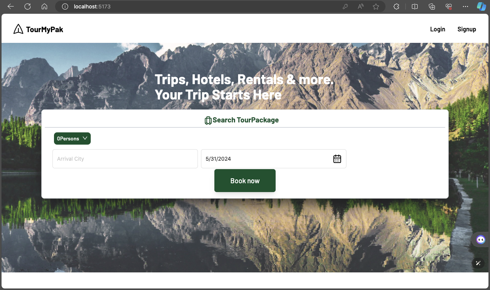

# MERN Tourism Web Application

This is a MERN stack based tourism web application designed to enhance user experience and provide a robust Tourism Management System (TMS) for the admin side.

## Features

- User-friendly interface for seamless navigation.
- Firebase authentication for secure signup/login via email.
- A recommendation system using K-means clustering to suggest places/packages based on user search history.
- Admin panel for managing tourism packages and other related tasks.
- Nodemon for automatic server restarts when your files change.

## Technologies Used

- MongoDB: A source-available cross-platform document-oriented database program.
- Express.js: A back end web application framework for Node.js.
- React.js: A JavaScript library for building user interfaces.
- Node.js: A back-end JavaScript runtime environment.
- Vite: A next generation front-end build tool.
- Tailwind CSS: A utility-first CSS framework for rapidly building custom user interfaces.
- Material UI: A popular React UI framework for faster and easier web development.
- Firebase: A platform developed by Google for creating mobile and web applications.
- Nodemon: A utility that will monitor for any changes in your source and automatically restart your server.

## Getting Started

To get a local copy up and running, follow these simple steps:

1. Clone the repository.
2. Install NPM packages using `npm install`.
4. Create a `.env` file in the root of your project and fill it with your own MongoDB connection string and Firebase configuration.
5. Run the application using `nodemon`.

## Contact

Your Name - itx.haroon1@gmail.com[itx.haroon1@gmail.com]